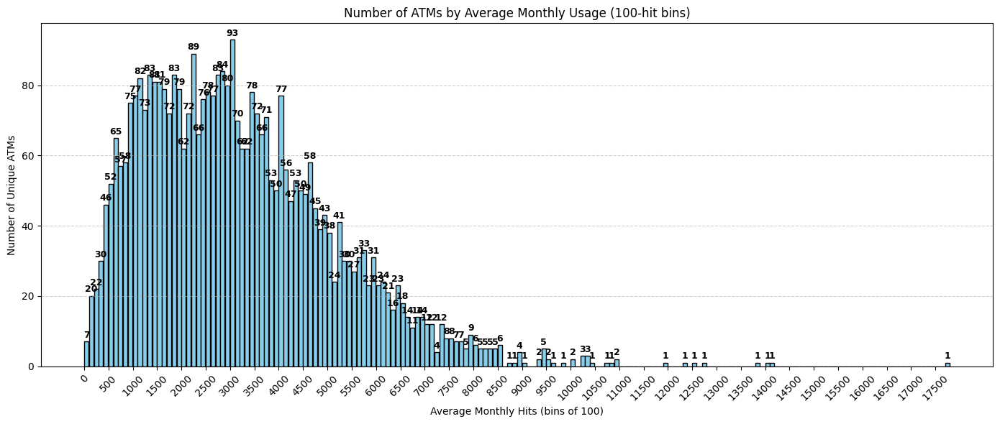

# ATM Predictive Maintenance Using Random Forest and XGBoost

## Project Title
Predictive Maintenance of ATM Utilizing Multi-Label and Binary Fault Classification Through Random Forest and XGBoost

## Author
Abhijeet Vaibhav

***

## Abstract
The project ensures continuous and reliable functionality of Automated Teller Machines (ATMs), which is crucial for banking operations. It compares two tree-based machine learning classifiers, Random Forest and XGBoost, for forecasting ATM fault occurrences. The classification includes multi-label detection of fault types and binary detection of fault presence. Evaluation metrics such as precision, recall, F1-score, and confusion matrices analyze their performance on real-world ATM datasets.

***

## Introduction
Unscheduled ATM downtime due to faults causes customer inconvenience and financial loss. Predictive maintenance strategies aim to identify these faults in advance using data-driven methods. This study applies Random Forest and XGBoost for both multi-label and binary classification to forecast faults, providing detailed diagnostics and enabling proactive maintenance interventions.

***

## Dataset and Preprocessing

- **Data Sources:** Transaction logs, metadata, site characteristics, and historical maintenance records spanning May to October 2021.
- **Features:** Categorical (ATM model, region, site type) and numerical (daily transactions, maintenance durations).
- **Encoding:** Ordinal encoding for categorical features.
- **Temporal Split:** May-September 2021 used for training; September-October 2021 for testing.

### Unique Fault Types and Counts
The dataset contains diverse fault events, with counts ranging from hundreds to hundreds of thousands, including:
- Communication failures
- Cassette faults
- Card reader failures
- Power issues
- Suspected skimming

(Refer to "Unique Fault Type and its count" table from the report for full details.)

### Fault Categories Summary
| Fault Category           |
|-------------------------|
| Card Reader Failure     |
| Cash Handler Fault      |
| Cashout Fault           |
| Cassette Fault          |
| Close                   |
| Communication Failure   |
| Depository Fault        |
| Encryptor Fault         |
| Power Failure           |
| Receipt Printer Fault   |
| Supervisor Switch On    |
| Suspected Skimming Attack|

***

## Exploratory Visuals

![Fault Type Frequency](

  
Fig 1: Distribution of ATM fault types.

![Fault Categories Merged](

  
Fig 2: Merged fault categories.

### Site Category Fault Counts

| Original Site Category              | Count   | Merged Site Category        | Count   |
|-----------------------------------|---------|-----------------------------|---------|
| Site not under special category   | 499,514 | Site not under special category | 499,667 |
| Other                             | 31,059  | Other                      | 32,589  |
| E-LOBBY                          | 20,890  | E-LOBBY                   | 19,890  |
| Lobby ATM                       | 14,535  | Lobby ATM                | 14,535  |
| ...                             | ...     | ...                        | ...     |

.
- Predicts multiple concurrent fault types per ATM.
- Features include ATM ID, model, type, region, transaction counts, and maintenance history.
- Targets are 12 fault categories (as listed above).

### 2. Binary Classification
- Predicts presence or absence of any fault.
- Uses aggregated fault labels or direct binary classifier.
- Similar features but binary target of fault/no-fault.

### Sliding Window Fault Prediction
- Observation window: 14 days of historical data.
- Buffer window: 7-day gap to prevent data leakage.
- Prediction window: Next 10 days for fault forecasting.
- Windows slide 7 days forward iteratively.
- Enables temporal adaptation and fault trend analysis.

***

## Results

### Random Forest Multi-Label Classification Metrics

| Fault Type                 | Precision | Recall | F1-Score | Support |
|---------------------------|-----------|--------|----------|---------|
| Card Reader Failure       | 0.84      | 0.90   | 0.87     | 44,607  |
| Cash Handler Fault        | 0.70      | 0.40   | 0.51     | 10,348  |
| Cassette Fault            | 0.88      | 0.90   | 0.89     | 50,159  |
| ...                       | ...       | ...    | ...      | ...     |

Binary classification achieves high precision and recall (>0.93 F1-Score).

.

.

***

### XGBoost Multi-Label Classification Metrics

| Fault Type                 | Precision | Recall | F1-Score | Support |
|---------------------------|-----------|--------|----------|---------|
| Card Reader Failure       | 0.84      | 0.91   | 0.88     | 44,607  |
| Cash Handler Fault        | 0.71      | 0.38   | 0.49     | 10,348  |
| Cassette Fault            | 0.88      | 0.89   | 0.89     | 50,159  |
| ...                       | ...       | ...    | ...      | ...     |

Binary fault detection with near-perfect precision and recall.

.

.

***

### Sliding Window Prediction Example (Window 1)

| Fault Type            | Precision | Recall | F1-Score | Accuracy |
|----------------------|-----------|--------|----------|----------|
| Card Reader Failure  | 0.837     | 0.931  | 0.881    | 0.894    |
| Cash Handler Fault   | 0.578     | 0.478  | 0.523    | 0.925    |
| Cashout Fault        | 0.762     | 0.548  | 0.638    | 0.938    |
| Cassette Fault       | 0.860     | 0.898  | 0.879    | 0.888    |
| ...                  | ...       | ...    | ...      | ...      |

(Similar tables available for other sliding windows.)

***

## Discussion

- Random Forest excels in training speed and balanced metrics.
- XGBoost offers better recall and detection sensitivity for common faults.
- Both models struggle with rare faults due to class imbalance.
- The sliding window approach captures short-term fault trends effectively.
- Combining binary and multi-label approaches enhances fault screening and diagnosis.

***

## Conclusion and Future Scope

- Both Random Forest and XGBoost provide robust predictive maintenance capabilities.
- Future focus includes improving rare fault detection via synthetic data, deep learning architectures (LSTM, Transformers), and ensembles.
- Integration of multimodal data and continuous learning from operational feedback will strengthen performance.

***

If you want the full detailed text along with the extracted images from the report for direct inclusion in a README.md file or similar, please specify, and this can be generated next.

[1](https://ppl-ai-file-upload.s3.amazonaws.com/web/direct-files/attachments/87713493/1feeb56c-144e-4238-b166-ff879a42be0b/Report-DDP-I-ATM-Predictive-Maintenance.docx)
